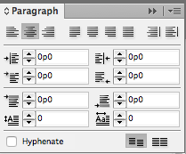

# Data Merge

Data Merge is a powerful tool in Adobe InDesign that allows you to create a template file and export many copies of that file, with data populated from an input source. Data Merge is a key tool at OMUN, as we use it to make the nametags, placards, and room signs. Therefore, understanding how to use it \(and what it's capable of\) is very important for any designer at OMUN.

### File Type {#file-type}

To use Data Merge, the input file needs to have the right file type. We recommend using either Comma Separated Values `.csv` file \(which can be exported from Excel or Google Sheets\), or a UTF-16 Unicode Text `.txt` file \(which can be exported from Excel\). Usually, a CSV is fine, but if the nametag values contain special characters \(e.g. é, ç, ü\) then you must use UTF-16 Unicode encoding to maintain the special characters.

### Input Format

Data Merge interprets different types of values \(e.g. School, Name, Position\) by a header row, where each column is a specific type of data. You should make a `.csv` or `.txt` file that has both the header  row and the data type.

&lt;IMG&gt;

In pages in this handbook that use Data Merge, a sample table that shows the header rows will be available.

| Row Name | Example |
| :--- | :--- |
| Delegate Name | Matthew Wang |
| Delegate School | Upper Canada College |
| ... | ... |

To import this file, select the Data Merge option in InDesign, and use "Select Data Source" to select your data. The resulting menu should show each of the data types you had.

&lt;IMG&gt;

### Layout

To use these data types, simply create text boxes and type in `<<Type Name>>` . You can also double-click the data type in the Data Merge menu to automatically put it into the document. This text is manipulatable like any other text.

&lt;IMG&gt;

While designing layouts using Data Merge, keep in mind the length of the possible data values: for long data such as delegate or school names, sufficient space is needed to allow the text to wrap into multiple lines. If not, some names will be cut off, which isn't fun for anybody!

If space allows, we suggest that you turn off hyphenation for text blocks, as they can be visually jarring and confusing. You can do this in the paragraph menu.

### Generating and Exporting

You can preview how a generated document by selecting "Preview", or use "Create Merged Document" to create an InDesign document with a spread for each set \(row\) of your data.

&lt;IMG&gt;

To create a final document to print, click "Export to PDF". The wide majority of settings are unimportant, though there are a few tidbits that are:

* Enable "Generate Overset Text Report" - this allows you to see if there's any overset text
* Use Single Record per Document Page, as our documents are always single-record spreads
* Merge All Records - there's no reason not to!
* The "High Quality Print" Preset is usually sufficient, though you can fiddle around with the settings if needed.

After exporting, you should have a PDF that you can send to print. We suggest that you take a cursory look through some of the nametags, just to be sure that there aren't any problems.

