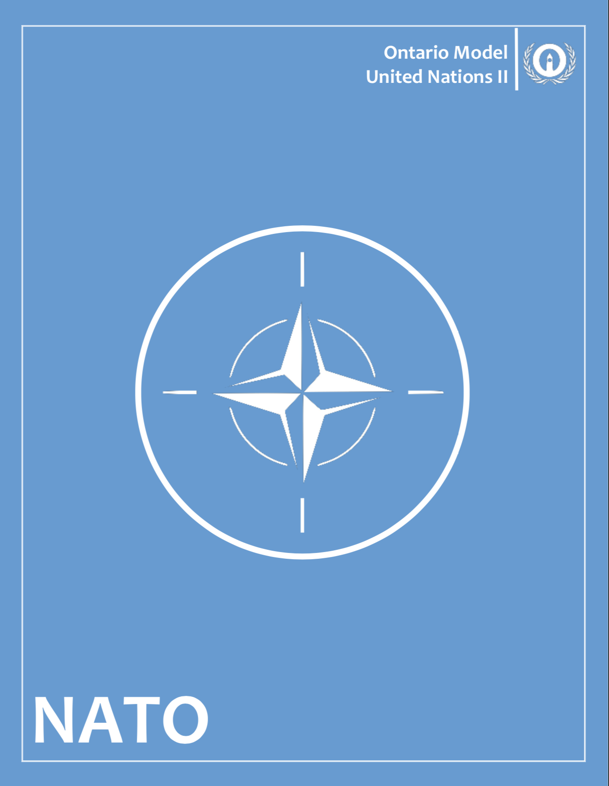
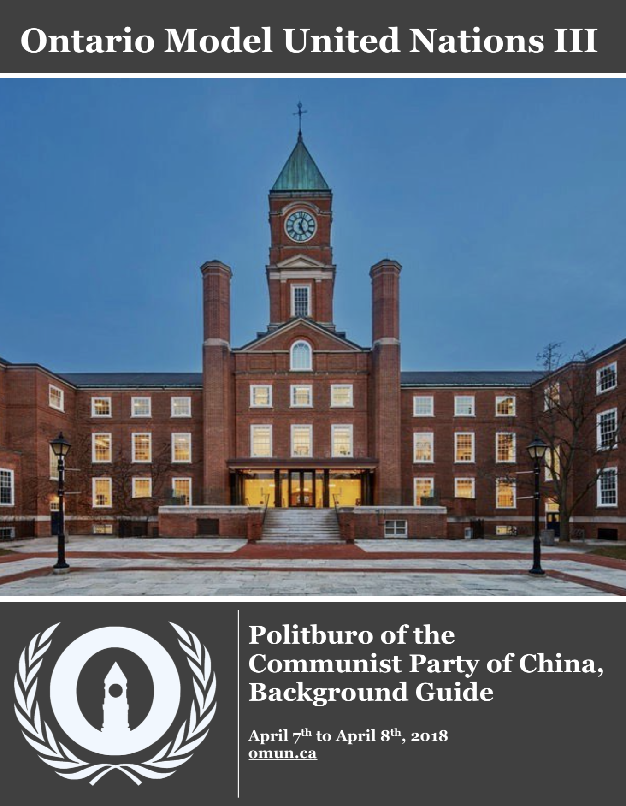
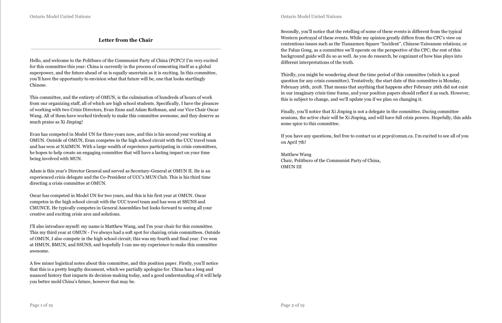
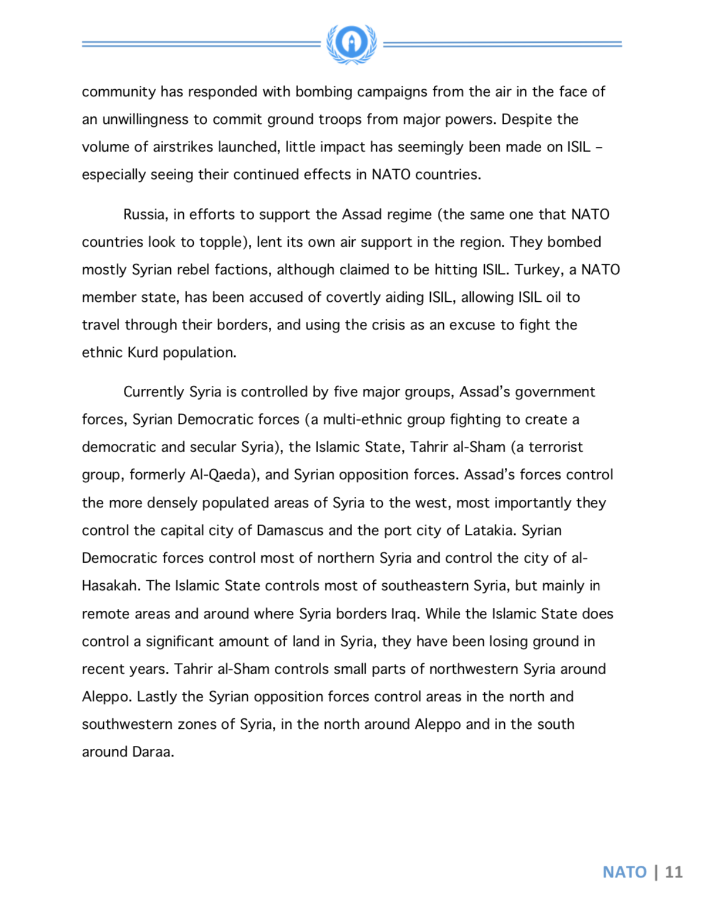
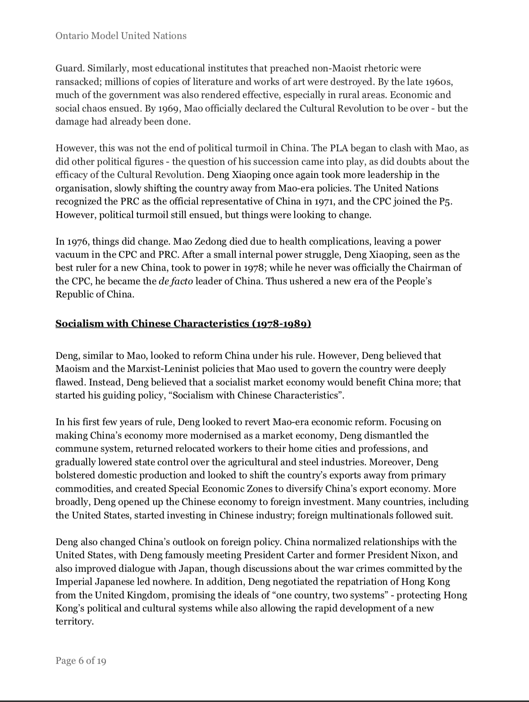
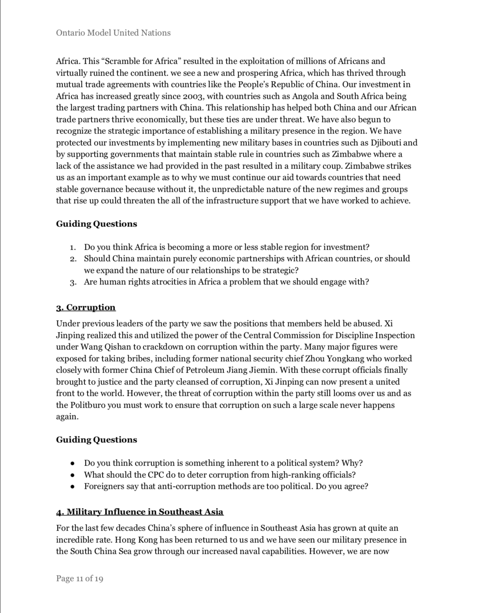
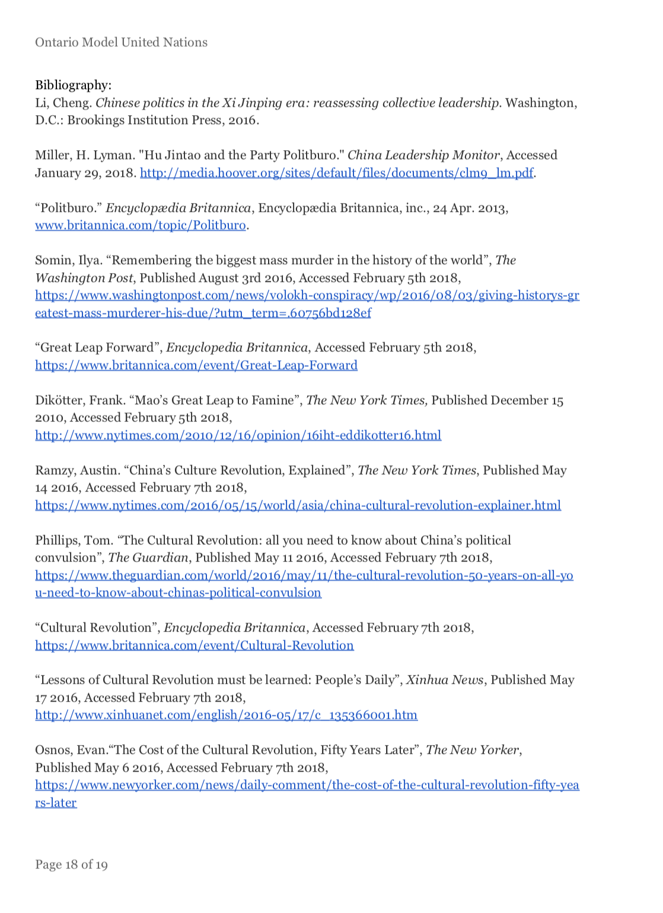

# Background Guides

Background Guides are a staple of any Model UN Conference: each committee writes one to inform delegates of what the committee is, what its purpose is, and what they \(as a delegate\) need to research and do. At OMUN, Background Guides are no different - and the tried-and-true formula makes them a relatively easy job to do from a design perspective.

Since Background Guides aren't especially design-oriented, in the past they've been made with word-processing software \(e.g. Microsoft Word, Pages\). Since Background Guides are often written by non-designers, this makes a lot of sense - everybody should have familiarity with Word!

## Composition

Background Guides consist of four parts: a cover page, a letter from the chair/dais, the content of the background guide, and a bibliography/citations.

### Cover

Keep the cover nice and simple. There's a lot of variety available, and it's mostly up to the team as to what works the best. Here are a few examples from previous years:

### Letter from Dais/Chair

This element is also simple - Background Guides usually have letters from the dais \(e.g. the chair, the vice-chair, the crisis director\) that introduce the staff and the committee, as well as conveying any brief information that the delegates would need to know about the conference. Most of the content and tone is up to the liberty of the dais - some choose to write it in character as the chair, while others choose to speak more informally.

### Content

This is what a Background Guide is known for - the actual writing that goes on in it! The direction of each Background Guide depends on who is writing it, so we recommend that you refer to the OMUN staff / director of chairing for more information.

  

### Sources/Bibliography/Citations

Good academic sourcing is extremely important for any background guide \(or academic work in general\), and OMUN is no exception. Historically, we have been subpar in formatting our sources and citations properly. Ideally, the director of chairing \(and/or the SGs/DGs\) choose a specific citation format and stick to it for the entire conference. Regardless, links should not just be copy-pasted as sources, and academic conventions should be followed. This is especially important as we ask delegates to do the same, and OMUN should lead by example.

