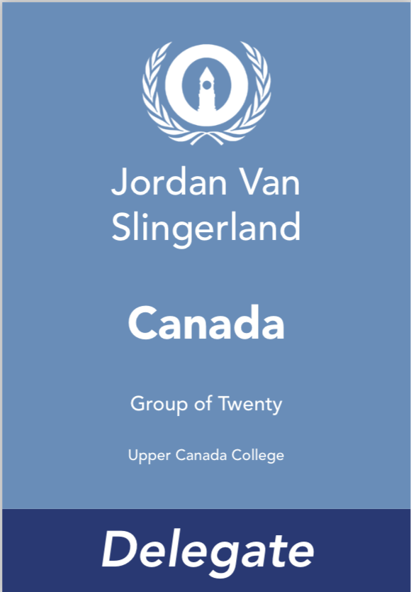
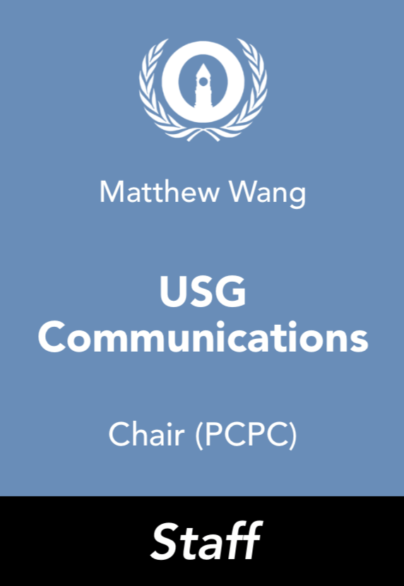
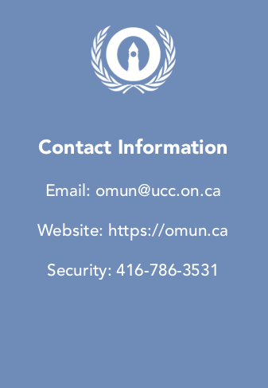

# Nametags

Nametags are an essential component of any conference: we give them out to delegates, staff members, and faculty advisors to identify who they are and give them access to quick resources. While the design itself isn't particularly complex, it does have a lot of moving parts \(and can be a headache to get working properly\)! 

There are four different types of nametags: delegate country nametags, which are given to delegates who represent countries or organizations in committee, delegate portfolio nametags, which are given to delegates who represent individuals with portfolios in committee, faculty advisor nametags, which are given to faculty advisors of a school, and staff nametags, which are given to OMUN staff. There are slight differences in how they're designed - keep that in mind!

Each nametag also has a back, which features quick contact information for the conference. The back is the same for all nametags.

### Data Merge

Nametags are made with Adobe InDesign using Data Merge - anybody looking to make them should familiarize themselves with its features. 

Placards have one to five Data Inputs, depending on what type of nametag they are.

#### Country Nametags

| Data Input | Example |
| :--- | :--- |
| Delegate Name | Matthew Wang |
| Delegate School | Upper Canada College |
| Delegate Country/Position | Canada |
| Committee \(Long\) | North Atlantic Treaty Organization |

#### Portfolio Nametags

| Data Input | Example |
| :--- | :--- |
| Delegate Name | Matthew Wang |
| Delegate School | Upper Canada College |
| Delegate Position Name | Xi Jinping |
| Delegate Position Portfolio | General Secretary of the Communist Party of China |
| Committee \(Long\) | Politburo of the Communist Party of China |

#### Faculty Advisor Nametags

| Data Input | Example |
| :--- | :--- |
| School | Upper Canada College |

#### Staff Nametags

Staff nametags can have secondary roles if someone has more than one role at once - this typically happens with USGs who also chair committees.

| Data Input | Example |
| :--- | :--- |
| Name | Matthew Wang |
| Role \(short\) | USG Communications |
| Secondary Role \(optional\) | Chair \(PCPC\) |

### Examples

