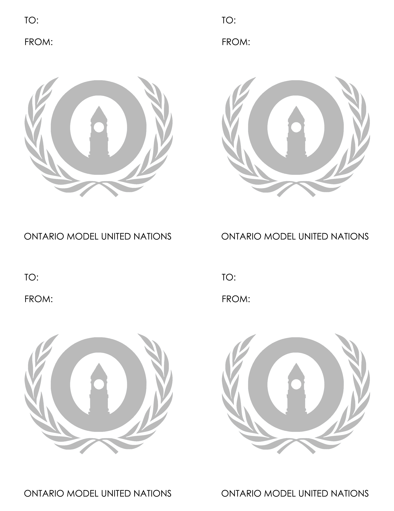

# Notepads

Notepads are a relatively low-cost, low-effort part of design at OMUN. They're given to delegates for note-taking and note-passing in committee. The design is completely arbitrary \(the example below is just what was used for OMUN 2018\), though the current design has been shaped by delegate feedback. They're very simple, are typically black and white/grayscale to cut down on cost, and typically have anywhere between 25 to 50 sheets per pad \(depending on what the conference wants\). The only key thing to look out for design-wise is to ensure that the notepad is function: there needs to be adequate space to write!

### Two Notes On Notepad Size/Printing

Notepads physically aren't US Letter - rather, they're typically one-half of US Letter's width and one-half of US Letter's length, or 4.25" by 5.5". To save on cost \(and to make this convenient for the print shop\), you can fit four Notepads on one US Letter Sheet, and then simply cut each US Letter sheet into four notepads once they're all printed. 

The other thing you'll notice is that there are no dates on the notepads. This means that you can batch print them \(e.g. order 1000 notepads\), then use that stash for several years of the conference. Before printing, double-check that there aren't any notepads left!

### Example

