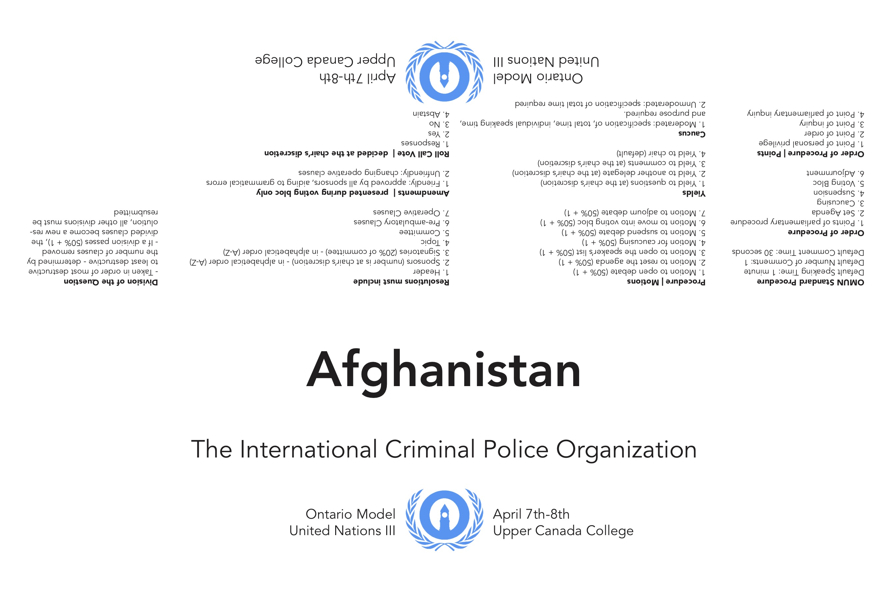
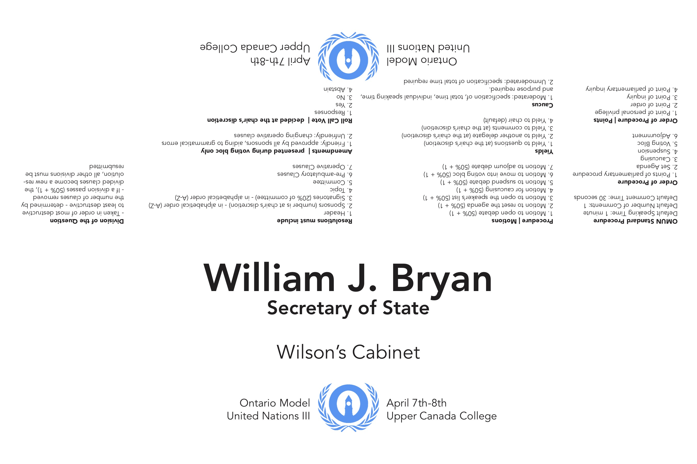
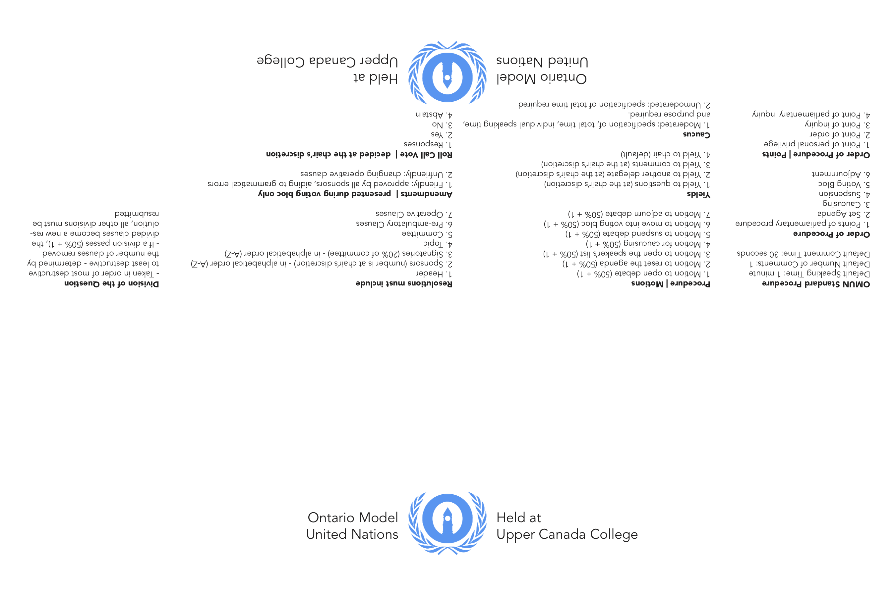

# Placards

Placards are an essential component of any conference: delegates use them to speak in caucus, know where they sit, and find out more information about committee procedure and general conference information. While the design itself for the placard isn't particularly complex, it does have a lot of moving parts \(and can be a headache to get working properly\)! 

There are two different types of placards: country placards, which are used for delegates representing countries or organizations in committee, and portfolio placards, which are used for delegates representing an individual with portfolio powers in committee. There are slight differences in how they're designed - keep that in mind!

### Data Merge

Placards are made with Adobe InDesign using Data Merge - anybody looking to make Placards should familiarize themselves with its features. 

Placards have two or three Data Inputs, depending on what type of placard they are.

For Country Placards:

| Data Input | Example |
| :--- | :--- |
| Committee \(Long\) | United Nations Security Council |
| Position | Canada |

For Portfolio Placards:

| Data Input | Example |
| :--- | :--- |
| Committee \(Long\) | Wilson's Cabinet |
| Name | William J. Bryan |
| Portfolio | Secretary of State |

### Examples

