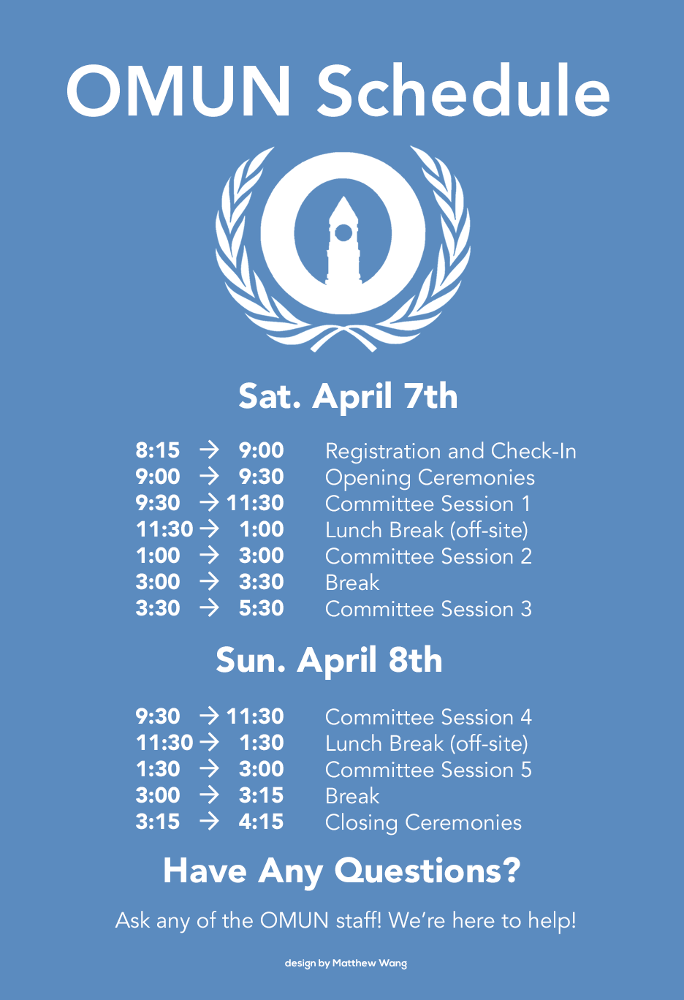
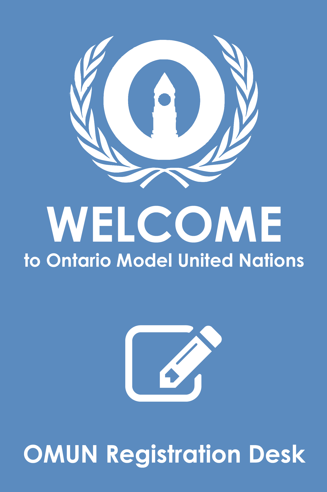

# Signage

Signage is pretty minor at OMUN - essentially, they're materials put around UCC to help people find what they need! There is no "correct" type of poster - it's all up to the designer! It just needs to be compelling and have the correct contact information.

OMUN makes two types of signage: schedule posters, and foam board directional signs. There are examples below, though they don't need to be strictly followed - do what is needed.

Posters can be any size and can be made in any program that the designer is comfortable with, though in the past OMUN Posters have been made in Photoshop and Illustrator and are typically 13" by 19" - a size that is the most "bang for the buck" for printing at the print shop. However, we recommend experimenting if it makes a better poster!

Large foam board signs, on the other hand, are much larger - often times made 24" by 36". They're quite expensive, so ensure that they're needed before sending in an order to the print shop! When using foam boards, think of longevity and reusability - not adding a date can make the board last for much longer!

### Examples

  

